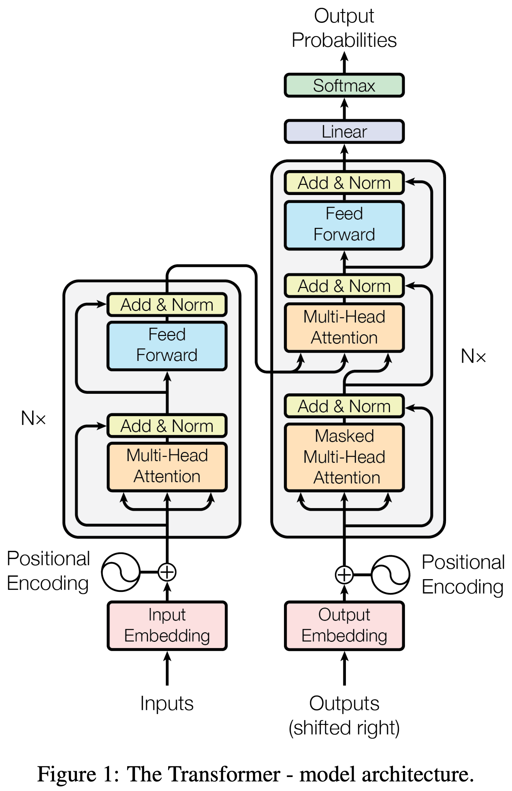

# GPT_build
Building (extremely simplified) character level, basic transformer-based language model to mimic Shakespeare

I have worked with Transformer-based language models that have been trained & optimized, but I am extremely curious regarding the underlying architecture & engineering involved.  This repository will serve as a place of personal exploration with a goal of satisfying this curiosity.  

This model was adapted & built while following along with a public lesson delivered by Andrej Karpathy, a person I deeply respect, a fascinating thinker, & leader in ML. When I first got involved with Machine Learning, it was [Karpathy's 2016 Stanford Course](https://www.youtube.com/watch?v=NfnWJUyUJYU) 15 Lessons that served as my gateway into the field.  I am happy to see that he still takes time to educate the public, & for that I am extremely grateful to him.  If you happen to stumble upon this, you may feel free to stick around, but I would advise following Karpathy's lesson instead. 
[Karpathy.ai](https://karpathy.ai) - [nanoGPT Repo](https://github.com/karpathy/nanoGPT)

 

Chat GPT - Generatively Pretrained Transformer - adapted from the 2017 [landmark paper](https://arxiv.org/pdf/1706.03762.pdf), titled **'Attention is All You Need'**.  In the paper, authors did not anticipate success, but the basic architecture presented in the paper was implemented throughout the ML space eventually overtaking all other models as being superior.   

<!--  -->

Train a basic transformer based language model, a character level model for simplicity; 
We will use Shakespeare; 
